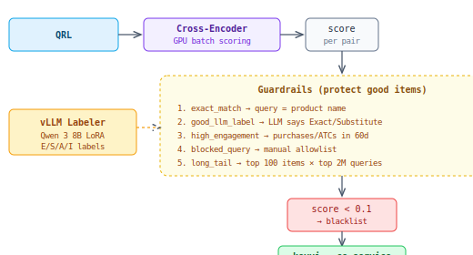

## LLM Filtering

Removes or buries irrelevant items from search results. The name is historical — training labels come from LLM inference (Qwen 3 8B LoRA), but the runtime model is a **cross-encoder** (sentence-transformers), not an LLM.

### Two modes

| | Offline (keyvi blacklist) | Online (real-time CE) |
|---|---|---|
| Where | Pre-retrieval: lookup from precomputed map | Post-retrieval: CE inference per item |
| How | `query → [blacklisted customer_ids]` from keyvi | `(query, item_text)` → similarity score |
| Latency | ~0ms (key lookup) | Higher (model scores each item) |
| Coverage | Only pre-seen query-item pairs | Any pair in real-time |
| Toggle | Default mode | `online_filtering_enabled=True` |

### Offline pipeline

At query time: `terms_processor` calls `ce_service.get_blacklisted_items(query)` → excluded from retrieval or buried with score penalty (`llm_filtering_boost`).

### Online mode

When enabled, after retrieval returns results:
1. `ce_service.get_online_filtering_similarities(query, customer_ids[])`
2. Returns `{customer_id: relevance_similarity}` per item
3. Items below `online_filtering_threshold` → buried

Also applies to CES results directly: `ces_gateway.online_filtering_remove_irrelevant()` removes bad CES neighbours before they enter the result set.

### Guardrails chain

Before a pair enters the blacklist, guardrails can **protect** it (remove from blacklist):

1. **very_high_filtering_score** — CE score >= 0.2 → too aggressive, discard
2. **exact_match** — query matches product name or facet value → never filter
3. **good_llm_label** — LLM says Exact/Substitute/Almost-irrelevant → protect
4. **high_engagement_item** — item had purchases/ATCs for this query (60d) → protect
5. **high_irrelevant_engagement_query** — ≥5 engaged-but-bad items → discard whole query
6. **blocked_item / blocked_query** — manual allowlists (e.g. "clearance", "sale")
7. **long_tail_item** — keep only top 100 items per query (lowest CE scores)
8. **long_tail_query** — keep only top 2M queries

### Training data: LLM labeling

Self-hosted vLLM (no external APIs). Domain-routed Qwen 3 8B LoRA models:

| Domain | Model |
|--------|-------|
| Fashion/apparel | `qwen-3-8B-lora-apparel` |
| Automotive | `qwen-3-8B-lora-car-countryside` |
| Home/furniture | `qwen-3-8B-lora-home-furniture` |
| General (default) | `qwen-3-8B-lora-general-extended-by-domains` |

4-class labels: **Exact / Substitute / Almost irrelevant / Irrelevant**

These labels supervise the cross-encoder training and serve as guardrail overrides.

### Key services

| Component | Location |
|-----------|----------|
| Serving integration | `autocomplete/terms_processor.py` |
| gRPC client to ce_service | `autocomplete/common/ce_service_client/` |
| Offline scoring pipeline | `data_pipeline/pipelines/semantic_search/llm_offline_mapping.py` |
| Guardrails | `data_pipeline/pipelines/semantic_search/transforms/llmf_guardrails.py` |
| vLLM labeler | `data_pipeline/pipelines/search_quality/ai_clients/vllm_labeler.py` |
