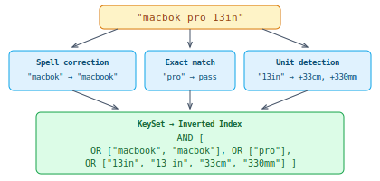
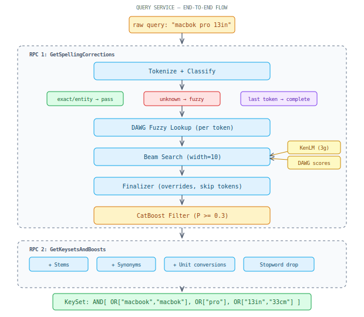

## Query Processing

gRPC service that transforms a raw query string into a structured `KeySet` (AND/OR tree of search terms) for the inverted index. Lives in `autocomplete/query_service/`.

### High-level view

Takes a raw user query, classifies each token (typo, known term, physical unit), corrects/expands where needed, and assembles a structured KeySet for retrieval.

### End-to-end flow

Two sequential RPCs. First corrects the query (tokenize → fuzzy lookup → beam search with LM scoring → ML filter). Then expands it (stems, synonyms, unit conversions) into an AND/OR KeySet consumed by the inverted index.

