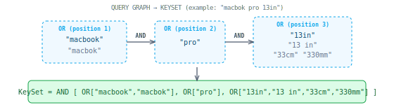

## Query Expansion (KeySet building)

Takes top correction candidates, builds a query graph (DAG), expands each node:

| Step | What it adds | Example |
|---|---|---|
| Stems | Morphological variants | "shoes" → + "shoe" |
| Two-way synonyms | Synonym group members | "laptop" → + "notebook" |
| One-way synonyms | Directed replacements | "couch" → + "sofa" |
| Smart synonyms | Unit conversions | "13in" → + "33cm", "330mm" |
| Stopword drop | Mark as optional | "for" → OR bypass |

The graph merges all correction candidates into one structure. Nodes at the same position form OR groups, sequential positions form AND:

### Synonym types

| Type | Example | Source |
|---|---|---|
| Two-way (group) | couch ↔ sofa ↔ settee | Manual curation |
| One-way (directed) | laptop → notebook | Manual curation |
| Smart (unit conversion) | 10mm → 0.39in | Computed from `cnstrc_qnlp` |
| Auto-synonyms | — | Mined from logs (experimental) |
