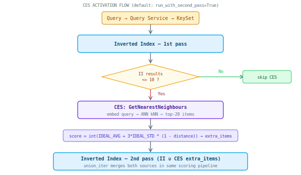
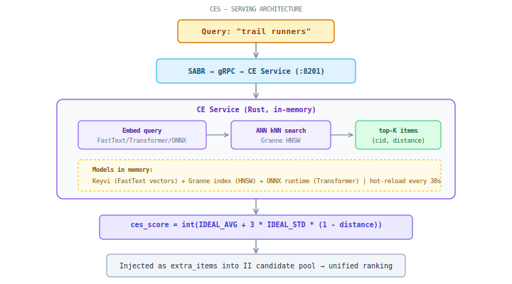
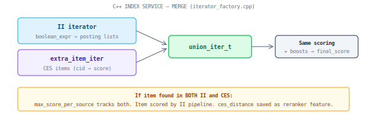
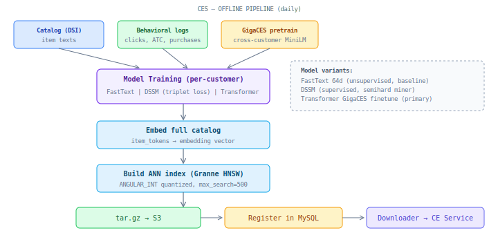

## CES (Cognitive Embedding Search)

Semantic retrieval supplement. Embeds query into vector space, retrieves nearest neighbours via ANN. **Activated only when inverted index returns too few results** (threshold: `num_inverted_index_result_when_used`, default 10).

### When CES fires

CES is **not** a parallel retrieval stream. It is a conditional supplement:

Default mode (`run_with_second_pass=True`): CES fires only after II 1st pass if `unfiltered_num_results <= 10`. CES items are injected as `extra_items` into the next II pass, where they compete in the same scoring pipeline.

### Serving architecture

**CE Service** — Rust binary (tonic gRPC, port 8201). Models loaded in memory (Keyvi mmap + Granne HNSW mmap). Hot-reload every 30 seconds (background thread, RwLock swap).

**CE Service Downloader** — Python sidecar. Polls MySQL registry every 5 min. Atomic directory swap for zero-downtime updates.

### How merge works (C++ core)

CES items enter `extra_items` dict (`customer_id → score`). Inside index_service:

Items from both sources flow through the same scoring/ranking pipeline. Per-item `max_score_per_source` tracks origin — used for `is_pure_ces()` classification and optional bury mode.

### Offline pipeline

Training scheduled by weekday: DSSM on Tuesdays, Transformer on Wednesdays. Full inference daily.

### Model architectures

| Model | Embedding | Training | Status |
|-------|-----------|----------|--------|
| FastText 64d | Skip-gram, subword | Unsupervised (catalog) | Baseline |
| DSSM | FastText + triplet loss | Supervised (clicks/ATC/purchases) | Some customers |
| Transformer GigaCES | MiniLM-based, ONNX | Cross-customer pretrain + per-customer finetune | **Primary for most** |
| CrossEncoder | BERT cross-encoder | Supervised | Online filtering, distillation |

### CES bury mode

When `bury_results=True`, pure-CES items (found only by CES, not II) are demoted to the bottom after reranking. CES widens the candidate set for reranker, but doesn't surface items unless they win on reranker score.

### ces_distance as reranker feature

Separately from retrieval, SABR calls `GetTokensToItemDistances` for top-N candidates → exact cosine distance → stored as `explanation['ces_distance']` → passed to reranker GBDT as a feature.

### Key parameters (per-customer)

| Parameter | Default | Description |
|-----------|---------|-------------|
| num_inverted_index_result_when_used | 10 | **CES trigger**: fire only if II returns ≤ this many |
| max_num_neighbours | 20 | How many CES candidates to request |
| max_distance | 0.8 | Cutoff for ANN results |
| run_with_first_pass | false | Inject CES before 1st II pass |
| run_with_second_pass | true | Inject CES before 2nd II pass (default) |
| bury_results | varies | Bury pure-CES items after reranking |
| block_query_2nd_pass | false | Skip query rerun if CES already contributed |

### Key services

| Component | Location |
|-----------|----------|
| CE Service (Rust) | `ce_service/` |
| CES Gateway | `autocomplete/fuzzy_autocomplete_server/ces_gateway.py` |
| C++ merge (union_iter) | `cnstrc_core/src/core_cpp/iterator_factory/` |
| Trigger logic | `autocomplete/fuzzy_autocomplete_server/terms_processor.py` |
| Training pipelines | `data_pipeline/pipelines/semantic_search/` |
