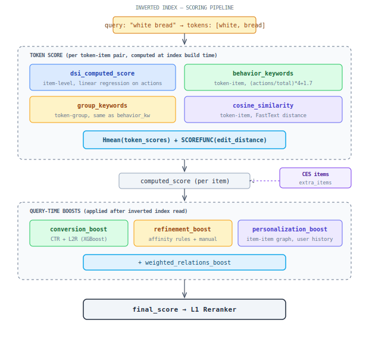
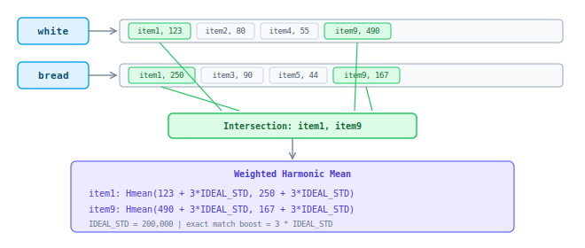
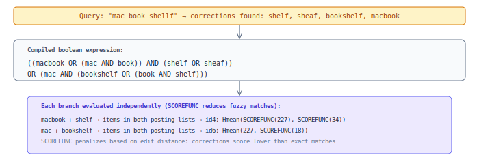

## Inverted Index (Base Model)

First-stage retrieval and ranking. Token → posting list → intersection → weighted harmonic mean. Final score = computed_score + conversion_boost + refinement_boost + personalization_boost.

### Scoring pipeline

### How intersection works

Query is tokenized. Each token is looked up in the inverted index (mapping from token → list of `(item_id, score)` pairs). Items found across **all** tokens (intersection) are scored via weighted harmonic mean:

For fuzzy matches (spell correction, levenshtein/phonetic/keyboard distance), **SCOREFUNC** reduces the score proportionally to edit distance.

### Boolean expression for complex queries

Spelling corrections produce multiple candidate interpretations, compiled into a boolean expression:

Each node carries a SCOREFUNC based on edit distance. The system evaluates all valid interpretations and picks the highest-scoring items across all branches.
