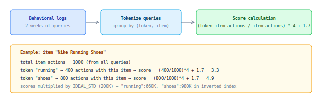

## behavior_keywords

Token-item affinity score. Measures how strongly a specific search token is associated with a specific item, based on behavioral logs.

### Formula

### Properties

| Property | Value |
|----------|-------|
| Scope | token-item pair |
| Delivery | MySQL (`data_set_items.ds_metadata_json → weighted_keywords`) |
| Applied at | Index build time |
| Range | [1.7 - 5.7] * 200,000 |
| Pipeline | `pipelines.feature_store.behavioral_keywords` |

### Fairness effect

Items returned by fewer queries naturally get higher behavior_keyword scores for those queries. If item X appears only for query "red", all clicks on X count toward "red" — high score. If item Y appears for 100 different queries, clicks are diluted across all tokens.

This creates an implicit fairness property: **the fewer queries can return an item, the higher it ranks for those specific queries**.

### Filtering

Only token-item pairs where `token-item actions / item actions > 0.1` AND token is present in `dsi.name` are stored.
