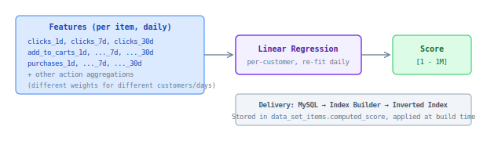

## dsi_computed_score

Item-level popularity score. Linear regression on daily action counts — predicts how "popular" an item is, regardless of query.

### Properties

| Property | Value |
|----------|-------|
| Scope | item-level (same for all queries) |
| Delivery | MySQL (`data_set_items.computed_score`) |
| Applied at | Index build time |
| Range | [1 - 1,000,000], default = -1 → assigns IDEAL_AVERAGE (900,000) |
| Used in | Search, Autocomplete, Browse |
| Pipeline | `pipelines.score_generation` |

### How it works

### Key properties

- Trained **per-customer** — different customers have different action patterns
- Weights are re-fitted **daily** — adapts to seasonal trends
- Default value for new items = IDEAL_AVERAGE (900K) — neutral, doesn't penalize cold-start items
- Cannot be A/B tested without index-level experimentation (baked into index at build time)
