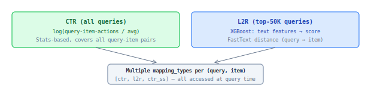

## Conversion Boost (query-items)

Query-item pair score. Adds relevancy and attractiveness signal based on historical engagement with specific items for this query.

### Two algorithms



### CTR (Click-Through Rate)

Aggregated query-item action counts:

```
score = log(query-item-clicks / avg(query-clicks)) * w1
      + log(query-item-a2c / avg(query-a2c)) * w2
      + log(query-item-purchase / avg(query-purchase)) * w3
```

Unlike `dsi_computed_score` (item-level), CTR is **query-item level** — same item can have different conversion boost for different queries.

### L2R (Learning to Rank)

XGBoost model predicting query-item action count. Applied only to **top-50K queries** (by volume). Features: FastText distances between query text and item text (customer-trained + glove-twitter-25 pretrained).

### Properties

| Property | Value |
|----------|-------|
| Scope | query-item pair |
| Delivery | S3 (data-pipeline) |
| Applied at | Query time |
| Toggle | `query-items` |
| Pipeline | `pipelines.query_items` |
| Used in | Search, Autocomplete |

### Difference from dsi_computed_score

| | dsi_computed_score | conversion boost (CTR) |
|-|-------------------|----------------------|
| Level | item | query-item |
| Actions from | all (search, browse, recommendations) | search only |
| Method | linear regression (weights change daily) | predefined log formula |
| Applied | index build time (via SCOREFUNC) | query time (additive) |
