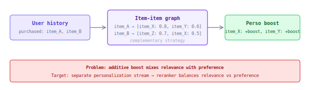

## Personalization Boost

User-level boost based on item-item similarity graph and user purchase/click history. If a user interacted with item A, similar items get boosted.

### How it works

### Graph structure

Item-item weighted directed multi-graph: `item_id → mapping_type → item_id → weight`.

`mapping_type` reflects the algorithm used for weight calculation. Primary algorithm: **Complementary Strategy** — items frequently purchased together in the same session.

### Properties

| Property | Value |
|----------|-------|
| Scope | user-item (via item-item graph + user history) |
| Delivery | S3 |
| Applied at | Query time |
| Pipeline | `pipelines.similar_items` |
| Used in | Search, Browse |

### Current limitations

Mixing personalization into retrieval score (as an additive boost) conflates relevance with preference:
- Makes debugging impossible — can't separate "why was this relevant?" from "why was this personal?"
- Couples systems — changes to perso affect retrieval scores
- Limited expressiveness — just an additive boost, can't do complex personalization logic

In the **target architecture**, personalization is a dedicated retrieval stream with its own candidates, and the reranker balances relevance vs preference explicitly.
