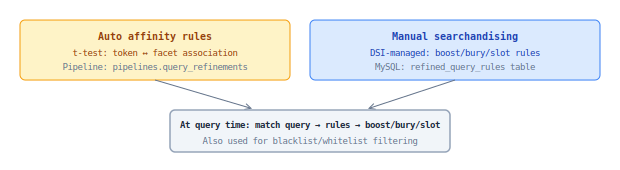

## Refinement Boost

Query-facet and query-item boost based on searchandising rules. Two sources: **auto-generated affinity rules** (statistical, t-test) and **manual rules** (DSI-managed).

### How it works

### Auto affinity rules (t-test)

Statistical measure of association between a query and a facet value:

1. Read behavioral logs, explode purchases by attribute
2. Tokenize queries
3. Calculate `search_count` and `action_count` per token-facet pair
4. Apply t-test comparing facet actions vs overall actions
5. t-statistic value = rule score

Example: query "nike" → facet `brand:Nike` has significantly more purchases → auto-generated boost rule.

### Manual rules

DSI creates rules like "for query Q, boost products with category C" or "slot item X at position Y". These override or supplement auto rules.

### SKU boost

A type of refinement rule applied to a specific `item_id`. Currently only manual (no auto-generated per-item rules).

### Interaction with reranker

If reranker is enabled, manual refinement boosts are:
1. **Subtracted** from items before sending to reranker (to not double-count)
2. **Re-applied** after reranker produces final order

### Properties

| Property | Value |
|----------|-------|
| Scope | query-facet or query-item |
| Delivery | MySQL (`refined_query_rules` table) |
| Applied at | Query time |
| Toggle | `manual_searchandizing`, `autorules` |
| Pipeline | `pipelines.query_refinements` |
