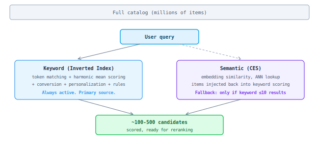

## L0: Retrieval

From a full catalog (millions of items) select ~hundreds of candidates for ranking. Two mechanisms: **keyword search** (primary) and **semantic search** (fallback when keyword returns too few results).

### How it works

### Example

**Query "nike air max"** — keyword search works well:

| Source | Result |
|--------|--------|
| Keyword | Products containing "nike" AND "air" AND "max" — Nike Air Max 90, Nike Air Max Plus, etc. Hundreds of matches. |
| CES | Not activated — keyword already returned plenty of results. |

**Query "comfortable everyday sneakers for walking"** — keyword struggles:

| Source | Result |
|--------|--------|
| Keyword | Intersection of ALL tokens. Very few products contain "comfortable" AND "everyday" AND "sneakers" AND "walking" in their fields. Returns ≤10 results. |
| CES | Activated. Finds Nike Air Max, Adidas Ultraboost, New Balance 990 by embedding similarity — semantically close even without exact token overlap. |

Keyword search handles ~95% of queries well (known brands, SKUs, common terms). CES fills the gap for long-tail/vague queries where strict token intersection yields too few results.

Default mode: CES fires **after** the first keyword pass if it returned too few results. CES items are injected into the second keyword pass where they compete in the same scoring pipeline. An alternative mode (`first_pass`) injects CES items before the first keyword pass — used experimentally for some customers.

### What goes into the retrieval score

Retrieval isn't just text matching. The inverted index score combines multiple signals:

| Signal | What it captures | Source |
|--------|-----------------|--------|
| Text relevance | How well the query tokens match the item | Indexed item fields (title, description, keywords) |
| Conversion history | How often users buy this item for this query | Behavioral logs (CTR, purchases) |
| Searchandising rules | Manual and auto-generated boosts/buries | Merchandising team + statistical rules |
| Personalization | User's past purchases boost similar items | Item-item similarity graph |

All signals are combined as **additive boosts** on top of the base text relevance score. This means the final retrieval score = text_match + conversion_boost + refinement_boost + personalization_boost.

### Practical implications

**For customers:** retrieval quality determines recall — whether the right products are even considered. If a product isn't retrieved, no amount of reranking can surface it.

**Coverage:** keyword search covers ~95% of queries well. CES fills the remaining ~5% (rare queries, new catalog items without behavioral data, semantic matches).

**Tuning levers:**
- Searchandising rules (boost/bury) directly affect retrieval scores
- Item metadata quality (titles, descriptions) determines keyword matchability
- CES threshold (`num_inverted_index_result_when_used`) controls when semantic fallback activates

### Current architecture trade-offs

Mixing conversion/personalization into retrieval score (as additive boosts) has practical consequences:

- **Debugging:** hard to tell if an item ranked high because it's relevant or because it's popular
- **Coupling:** changing personalization logic affects retrieval scores, can break searchandising expectations
- **Limited personalization:** only additive boost from item-item graph, no per-user retrieval
