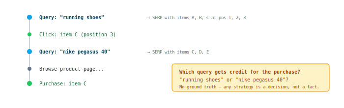
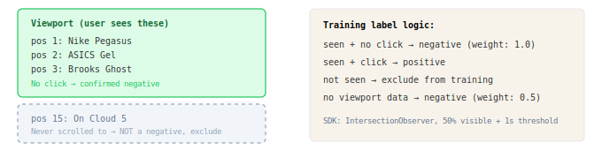

## Attribution

Connects user actions (clicks, add-to-cart, purchases) back to the search query that caused them. Produces training labels for all ML models. Errors here directly corrupt model training and metrics.

### The Problem



```
Session:
  t=0: Query "running shoes" → SERP with items A, B, C at pos 1, 2, 3
  t=1: Click item C (position 3)
  t=2: Query "nike pegasus 40" → SERP with items C, D, E
  t=3: Browse product page...
  t=4: Purchase item C

Question: Which query gets credit for the purchase?
"running shoes" or "nike pegasus 40"?
No ground truth — any strategy is a decision, not a fact.
```

Key problems:
- **Ambiguous attribution:** same item appears in multiple queries before purchase — unclear which query caused it
- **Unobserved negatives:** item in results but never seen by user (didn't scroll) — not a negative, it's missing data
- **Personalization leakage:** repeat queries in session contain features that encode previous actions on the same item

### Data Sources

| Source | Contains | Captured at |
|--------|----------|-------------|
| Query Results Log (QRL) | Query, results, positions, features | Serving time (before action) |
| Behavioral Log (BL) | User actions: click, ATC, purchase | Moment of action |
| Viewport Impressions | Which positions user actually saw | Scroll time (client SDK) |

### Server-side attribution (not client-side)

Attribution logic runs in the offline pipeline, not computed on the client.

- Allows re-computing data for any period when strategy changes or bugs are found
- Client request_id/position is a hint for disambiguation, not a substitute for server-side join
- Exception: viewport impressions — this signal physically doesn't exist in server logs

### Viewport Impressions



Without viewport data, the pipeline cannot distinguish "user saw item and ignored" from "user never saw item". Both appear as `has_click=false`.

Negative signal gradation:

| Signal | Confidence as negative |
|--------|----------------------|
| Seen >1s, no click | High — conscious skip |
| Clicked, bounce <5s from PDP | Medium — mismatched expectation |
| Clicked, returned to SERP | Medium — not satisfied |
| Not seen (didn't scroll) | Not a negative — exclude |

### Personalization Leakage

When a user repeats the same query after clicking an item, personalization features already encode the previous action.

```
Session:
  query "shoes" (t=0)  → features: perso_boost=0    → click item X
  query "shoes" (t=30s) → features: perso_boost=HIGH → item X appears again

Problem: perso_boost at t=30s contains the label (click at t=0)
Solution: keep only first request per (normalized_query, session)
```

### Attribution Strategy Evaluation

No ground truth for "correct" attribution. Any strategy (last-click, first-click, fractional) is a decision. Evaluation method:

- **Offline proxy:** train model on attribution variant → eval NDCG on held-out deterministic clicks (clicks don't require attribution — unambiguous binding to request)
- **Online A/B:** if offline difference is significant — deploy models trained on different variants, compare revenue/CTR
- **Pragmatic check:** if model trains primarily on clicks, difference between purchase attribution strategies is minimal (<5% of positives)

### Dataset Quality Metrics

| Metric | What it measures | Alert threshold |
|--------|-----------------|-----------------|
| Click join rate | % of clicks matched to a QRL entry | > 90%, drop >5% day-over-day |
| Distribution alignment | Spearman correlation: item popularity in BL vs QRLI | > 0.7 |
| Label rate stability | Positive rate consistency over time | < 20% relative change day-over-day |
| Position CTR monotonicity | CTR decreases with position in top-5 | Strictly monotone in top-5 |
| Orphan clicks | Clicks attributed to query but item missing from results | < 1% |
| Personalization leak rate | Training examples where user already interacted with item | → filter with take_first_request |
| Attribution quality | Model with all labels vs clicks-only on held-out clicks | NDCG(full) >= NDCG(clicks-only) |
