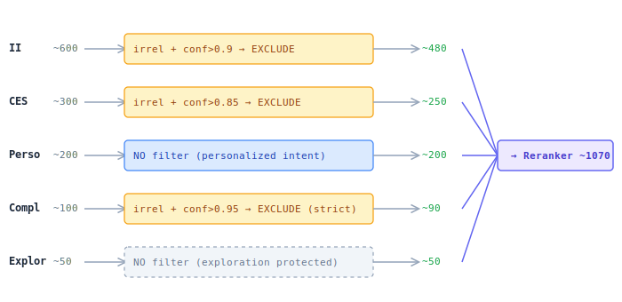

## LLM Pre-filter

Offline LLM labels. Keyvi lookup at serving. Each stream is filtered independently with its own threshold.

### Principle

- Each stream is filtered **independently** with its own threshold
- **Personalization and Exploration — not filtered** (protected streams)
- Complementary — strict threshold (0.95) due to high irrelevance risk
- II vs CES — different confidence thresholds (II items are more reliable via lexical match)

### Labels

| Label | Score | Action |
|-------|-------|--------|
| Exact | 3 | PASS (always) |
| Substitute | 2 | PASS (configurable per stream) |
| Complement | 1 | PASS (configurable per stream) |
| Irrelevant | 0 | EXCLUDE if confidence > threshold |

### Guardrails (applied at labeling time)

- **Exact match:** query == item name → forced label "exact"
- **High CTR:** item has high click-through rate for this query → label cannot be "irrelevant"
- **Blocklist:** specific items/queries → never filtered
