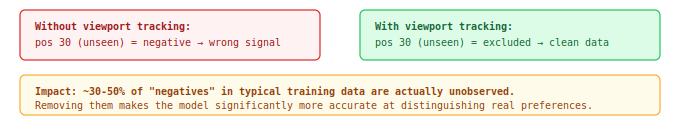

## Viewport Tracking

Client SDK integration that reports which search results the user actually saw. Required for correct negative labeling and more accurate CTR estimation (clicks / actual views instead of clicks / results returned).

### Why required

Without viewport data, the system treats all unclicked results as negatives — including items the user never scrolled to. This corrupts training: the model learns that items at position 30+ are "bad" when the user simply never saw them.

### Integration Requirements

| Requirement | Details |
|-------------|---------|
| SDK placement | After search results render, observe each result DOM element |
| Visibility threshold | 50% of element area visible in viewport |
| Time threshold | >= 1 second continuously visible |
| Request binding | Each impression tied to request_id from search response |
| Mouse hover (optional) | Track hover >1s on item — additional engagement signal between impression and click |
