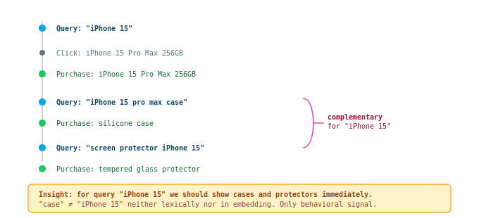

## Complementary Items Stream

Items that users historically purchased/clicked **in the same session** after a given query, but not directly from it.

### Why needed: behavioral pattern



### Graph construction (offline)

Graph: **query → items purchased in the same session but from different queries**.

```
For each session:
  1. Find all queries
  2. Find all purchases/ATC
  3. For each query Q:
     - items purchased NOT from Q, but in the same session → complementary for Q
     - edge weight = count(sessions) × action_weight

Additional signals:
  - Catalog relations: "accessory for", "compatible with" (from customer data)
  - Cross-session: user bought X → 3 days later bought Y → weak signal
```

### Examples

| Query | Complementary items | Why II/CES won't find them |
|-------|--------------------|-----------------------------|
| "iPhone 15" | cases, chargers, screen protectors, AirPods | No lexical overlap |
| "running shoes" | running socks, insoles, shoe spray | "shoe spray" is far in embedding space |
| "coffee machine" | beans, descaler, milk frother | Different category entirely |
