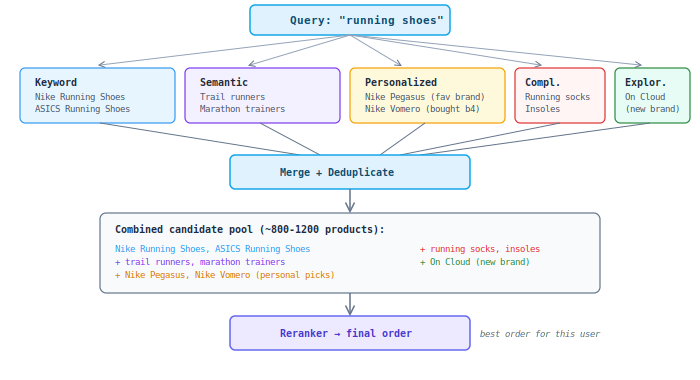

## L0: Multi-Stream Retrieval

No single search method finds everything. We use **5 different strategies** in parallel, each specialized for a different type of discovery. Together they ensure we never miss a good product.

### Why multiple sources?

No single search method finds everything. Each has blind spots:

### Example: searching "running shoes"

| Source | What it contributes | Why needed |
|--------|-------------------|-----------|
| Keyword | All products with "running shoes" in title | Exact matches — the obvious results |
| Semantic | "trail runners", "joggers", "marathon trainers" | Different words, same meaning |
| Personalized | Nike models (user's preferred brand) | User bought Nike 3 times before |
| Complementary | Running socks, insoles, shoe spray | 80% of running shoe buyers also buy these |
| Exploration | New brand "On Running" just added to catalog | Zero clicks yet, but highly relevant |

Each source delivers its best candidates independently — typically 800-1200 unique products total. They are merged into one pool and sent to the Reranker, which determines the final order considering all signals together.

**Key principle:** each source specializes in finding products the others would miss. No single method covers all cases — keyword search misses synonyms, semantic search misses exact SKUs, and neither knows the user's personal preferences.

### Adaptive per query

The balance between sources shifts based on the query type:

| Query type | Emphasis | Why |
|-----------|----------|-----|
| "Nike Air Max 90" (specific) | Keyword dominant | User knows exactly what they want |
| "gift for mom" (vague) | Semantic + Personalized dominant | No specific product in mind, need discovery |
| "red dress under $50" (filtered) | Balanced, hard filters applied | Clear constraints but open to options |
