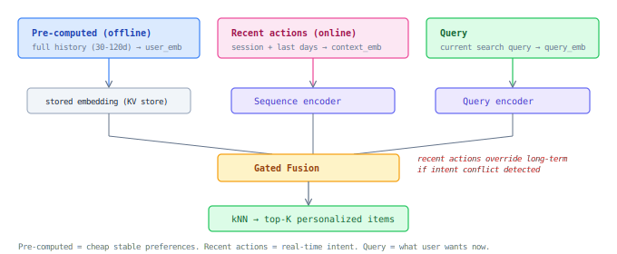

## Personalization Stream

Problem: top-1000 by relevance alone may miss products important for a specific user (recall ceiling). Dedicated personalization stream delivers candidates based on user preferences as a separate kNN retrieval path.

### Architecture



### Two signals + query

| Signal | Computed | Captures | Update frequency |
|--------|----------|----------|-----------------|
| **Pre-computed user embedding** | Offline (daily batch) | Stable preferences: brands, categories, price range | Daily |
| **Recent actions embedding** | Online (real-time) | Session + last days: current intent, evolving interests | Per request |
| **Query** | Online | What the user is searching for right now | Per request |

Recent actions can override long-term: user historically buys dresses, but this session searches for sneakers → personalization stream should retrieve sneakers, not dresses.

### User embedding quality requirement

Same validation principle as CES: it must be **possible** to train a simple probe `user_embedding → attribute` that predicts user characteristics. Not a shipped feature — a quality metric for the embedding.

| Vertical | Should be predictable from embedding |
|----------|--------------------------------------|
| All customers | gender, age group, price sensitivity |
| Baby/kids stores | pregnancy, child age stage |
| Pet stores | animal type (cat/dog/bird) |
| Fashion | style cluster, size range |

If a linear probe can't recover these from the embedding — the embedding isn't capturing real user preferences, just noise.

### Semantic IDs

Learned hierarchical taxonomy via RQ-VAE or recursive k-means on item embeddings:

```
item → semantic_id: 7.34.12.5
                    domain.type.subtype.cluster
```

- 100% item coverage, learned granularity
- Natural multi-label (item is close to multiple prefixes)
- User profile as distribution over prefixes → compact personalization signal
- Query encoder predicts prefix → category constraint without manual taxonomy
- **Cross-customer:** shared ID space across all customers (enables transfer learning, shared pretrain)
- **Stable:** adding new items must not change existing IDs — new items get assigned to existing clusters or spawn new leaf nodes, never reshuffling the tree

### Alternative: LLM on semantic ID sequences

Train a language model on sequences of semantic IDs + query to predict next purchases:

```
Input:  [7.34.12.5, 7.34.8.2, 3.12.1.9] + query "running shoes"
Output: predicted next semantic IDs → decode to item candidates

Training: user purchase sequences as "sentences" of semantic IDs
Inference: autoregressive generation → top-K predicted IDs → retrieve items
```

- Naturally captures sequential patterns (bought phone → will buy case)
- Query conditions the generation (same user, different query → different predictions)
- **Bonus: explainability** — semantic ID prefixes are interpretable ("recommended because you bought items in cluster 7.34 = running gear")
- Can generate diverse candidates by sampling (temperature > 0)
