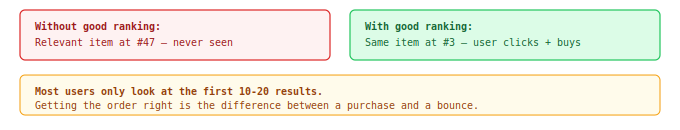
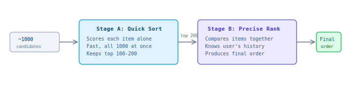
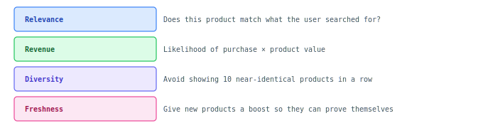

## L1: Reranker

Retrieval finds ~1000 potentially good products. The Reranker's job: **put them in the best possible order** — so the top 10-20 results are exactly what the user wants to buy.

### The Problem

Finding relevant products is only half the battle. The **order** matters enormously:

### Two stages: fast then precise

Scoring 1000 products with a complex model would be too slow. So we use two stages:

### What it considers

The reranker balances multiple objectives simultaneously — not just "is this relevant?" but a holistic decision:

These weights are **declaratively configurable per customer** — DSI sets the balance, not the algorithm. A luxury brand may want more relevance + diversity; a deal site may want more revenue.

Additionally, **Quotas per stream** influence what the reranker sees: if QU allocates more candidates from personalization, the reranker naturally has more personalized options to rank highly. The reranker optimizes within what retrieval delivers.

### Personalization in ranking

The reranker knows the user's history — what they've clicked, added to cart, and purchased before. This shifts the ranking for each individual:

| Same query: "dress" | User A (luxury buyer) | User B (budget buyer) |
|---------------------|----------------------|----------------------|
| Position #1 | $200 silk dress (matches purchase history) | $35 cotton dress (matches price range) |
| Position #2 | $180 linen dress (same brand they bought) | $29 summer dress (similar to past clicks) |

Same products in the pool — different order for different users.

### Resilience

The system is designed to degrade gracefully if something goes wrong:

| If this fails... | What happens | User impact |
|-----------------|--------------|-------------|
| Stage B (neural model) | Fall back to Stage A scores | Slightly less personalized, still relevant |
| User history unavailable | Rank without personalization | Generic but relevant results |
| Everything fails | Use retrieval order directly | Reasonable results, not optimized |
