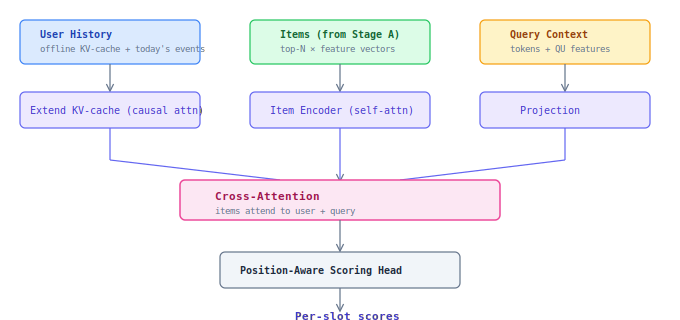

## Stage B — Neural Listwise

top-N → final order. Sees all items simultaneously (listwise). GPU inference (batched).

### Architecture



### User History: Incremental Inference (KV-cache)

```
Batch (daily, offline):
  Full history up to yesterday → User History Encoder → KV-cache states → store

Online (per request):
  KV-cache (from store) + today's events (1-20 tokens) → continue attention → user repr
```

Encode 1-20 new tokens instead of 100-500 — order of magnitude cheaper. Standard pattern from LLM inference.

### Unified Objective

```
L = α·L_relevance + β·L_revenue + γ·L_diversity + δ·L_freshness
```

- **L_relevance** — LambdaRank on click/atc/purchase + LLM relevance labels
- **L_revenue** — calibrated P(purchase) x item_value
- **L_diversity** — penalty for redundancy in top-K
- **L_freshness** — reward for exposure of new/underexposed items

Weights α, β, γ, δ — config per customer, not learned. Inference-time parameter (no retraining required).
