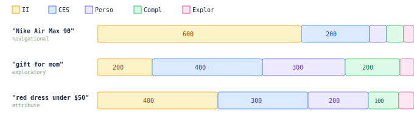

## Quotas Per Stream (Engineering)

QU determines quotas for each stream per-query based on intent and query characteristics.

### Quota examples by query type



```
"Nike Air Max 90" (navigational):  II=600, CES=200, Perso=50, Compl=50, Explor=20
"gift for mom" (exploratory):      II=200, CES=400, Perso=300, Compl=200, Explor=50
"red dress under $50" (attribute): II=400, CES=300, Perso=200, Compl=100, Explor=30
```

After deduplication, the total candidate pool is ~800-1200 unique items → reranker.

### QU per-query (dynamic)

| Query type | II | CES | Personal | Complementary | Filters |
|-----------|-----|-----|----------|---------------|---------|
| Navigational ("Nike Air Max 90") | k↑ | k↓ | k↓ | k↓ | category: strict |
| Abstract ("gift for mom") | k↓ | k↑ | k↑ | k↑ | category: off |
| With attributes ("red dress under $50") | k=base | k=base | k=base | k↓ | price + color |
| Typo / garbage | k↓ | k↑ | k=base | off | off |

### Query features driving decisions

- **specificity**: high → more II; low → more CES + personal
- **has_structured_constraints** → extract and apply filters (price, brand, attributes)
- **personalization_opportunity** → scale personal stream
- **ambiguity** → disable category constraint, increase diversity

### Per-customer config (declarative)

DSI describes **what behavior is desired**, not how to achieve it. The system decides the "how" per-query.

```yaml
streams:
  II:              {enabled: true}
  CES:             {enabled: true}
  personalization: {enabled: true, min_user_interactions: 5}
  complementary:   {enabled: true}
  exploration:     {min_fraction: 0.03, max_fraction: 0.15}
```

Config declares intent and boundaries. QU makes concrete per-query decisions (exact quotas, filters, routing) within those boundaries based on each query's characteristics.
