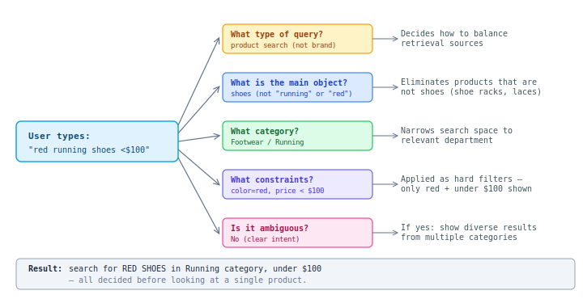
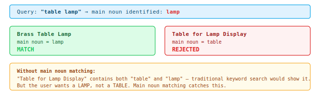
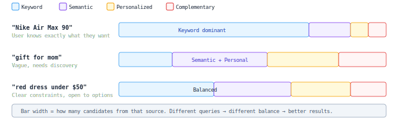

## Query Understanding

The first step in search: before we look at any products, we analyze the query itself to understand **what the user actually wants** and **how to search for it**.

### The Problem

A raw search query like "red running shoes under $100" is just a string of words. Without understanding it, we face a dilemma:

- **Require all words to match** → almost nothing matches (no product title contains "red running shoes under $100" verbatim)
- **Match any word** → garbage results (shoe racks, red dresses, $100 gift cards)

Query Understanding resolves this by breaking the query into structured decisions **before** retrieval: "shoes" is the main object, "red" is a color filter, "$100" is a price constraint, "running" narrows the category. Now the system knows exactly what to look for.

### What it does

### Why "main noun" matters: preventing bad results

The most common source of irrelevant results: a product contains all the right words, but IS the wrong thing.

### Handling ambiguous queries

Some queries could mean multiple things. QU detects this and adjusts the strategy:

### Attribute extraction: turning words into filters

When a query contains specific requirements, QU extracts them as hard filters so the user only sees products that actually match:

| Query | Extracted filters | Effect |
|-------|------------------|--------|
| "red dress under $50" | color: red, price: < $50 | Only red dresses under $50 shown |
| "samsung tv 55 inch" | brand: Samsung, size: 55" | Only Samsung 55" TVs shown |
| "wireless headphones" | feature: wireless | Wired headphones excluded |
| "gift for mom" | (none extracted) | Broad search, rely on semantics + personalization |

The principle: everything that can be a precise filter, becomes one. This guarantees the user's explicit requirements are met — no "$120 shoes" in results when they said "under $100".

### Summary: what QU decides per query

| Decision | Effect on search |
|----------|-----------------|
| Intent type | How to balance different retrieval sources (keyword vs semantic vs personalized) |
| Main noun | What the product must BE (eliminates wrong product types) |
| Category | Which department to search in (can be strict or soft) |
| Attributes | Hard filters (price, brand, color, size) |
| Ambiguity level | Whether to diversify across categories or focus narrowly |

All these decisions happen in milliseconds, before any products are retrieved. This makes the rest of the pipeline dramatically more focused and accurate.

### Balancing retrieval sources

The system searches for products using multiple strategies in parallel (keyword matching, meaning-based, personalized, etc. — see L0 for details). QU decides **how much weight to give each strategy** depending on the query type:

A specific query like "Nike Air Max 90" gets mostly keyword results (user knows what they want). A vague query like "gift for mom" gets more semantic and personalized results (needs discovery). This happens automatically per query.
